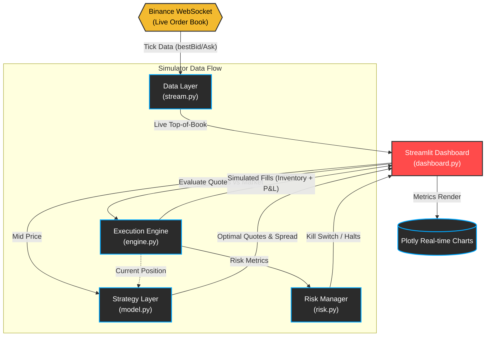
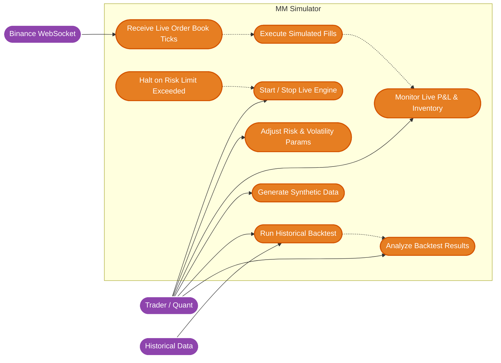
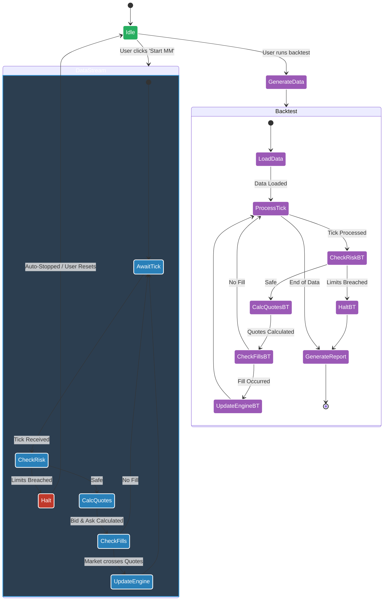

<h1 align="center">Market Making Simulator 📈</h1>

<p align="center">
  <strong>A professional-grade quoting simulator using the Avellaneda-Stoikov model on live Binance data and historical backtesting.</strong>
</p>

<p align="center">
  
  
  
  
</p>

---

## ⚡ Overview

This repository features a comprehensive market making simulation suite that illustrates the intersection of deterministic infrastructure and stochastic control theory. The simulator includes both live trading demonstrations and historical backtesting capabilities.

The live simulator connects to real-time crypto markets (via free Binance WebSockets), computes high-frequency bid/ask quotes dynamically based on inventory exposure, and visualizes live P&L data using a sleek Streamlit dashboard.

The backtesting module allows for offline analysis using synthetic or historical data, enabling strategy optimization and performance evaluation across different market conditions.

It replicates the fundamental architecture of what quantitative developers handle at firms like Jane Street—from maintaining low-latency data feeds to implementing risk limits and automated kill switches against drawdowns.

---

## 🚀 Features

- **Live Order Book Sync:** Streams real `BTCUSDT` and `ETHUSDT` tick data over WebSockets (latency-optimized background threading).
- **Dynamic Quoting (Avellaneda-Stoikov):** Calculates optimal bid and ask spreads using stochastic control parameters.
  - Generates a tailored **Reservation Price** factoring in your current inventory skew.
  - Dynamically widens or narrows **Optimal Spread** based on market volatility and set liquidity density.
- **Advanced Market Regime Detection:** Real-time classification into CALM, TRENDING, and VOLATILE states with confidence scoring.
- **Volatility Estimation:** Rolling window standard deviation with 100-tick history for adaptive risk management.
- **Microprice Calculator:** Order book weighting for divergence signals and reservation price adjustments.
- **Dynamic Position Sizing:** Kelly-inspired sizing with multi-factor adjustment (confidence, volatility, inventory utilization).
- **Adverse Selection Analysis:** Toxicity detection measuring quote fill quality and execution costs.
- **Simulated Real-time Fills:** Top-of-book crossover deterministic matching system. Watch your inventory spike as market swings trigger fill conditions against your quotes!
- **Strict Risk Management Layer:** Built-in "Kill Switch" circuitry that bounds maximum inventory ($BTC/$ETH) and caps unrealized drawdowns.
- **Live Analytical Dashboard:** Instant visualization of realized/unrealized P&L, quote distribution relative to mid-price, and inventory positioning using responsive Plotly charts.
- **Historical Backtesting:** Run the strategy on synthetic or historical data to evaluate performance, optimize parameters, and analyze different market regimes.
- **Synthetic Data Generation:** Generate realistic market data with configurable volatility regimes, order flow imbalance, and microprice dynamics.
- **Backtest Reporting:** Automated HTML reports with detailed P&L analysis, trade logs, and performance metrics.
- **Parameter Sensitivity Analysis:** Grid search optimization across gamma and liquidity parameters.
- **Performance Analytics:** Sharpe/Sortino ratios, max drawdown, win rate, and rolling statistics.

---

## 🏗️ Architecture



The simulator is built entirely in Python, reflecting a modular, micro-service-like component design:

```text
📁 mm-simulator/
├── stream.py          # WebSocket Manager feeding order-book top states to shared memory
├── model.py           # Core Math (Avellaneda-Stoikov parameterizations + AI prediction)
├── engine.py          # Virtual matching engine assessing real-market hits against our quotes
├── risk.py            # Independent observer enforcing threshold logic to halt trading
├── dashboard.py       # Streamlit GUI coordinating threads, state loops, and Plotly UI
├── backtest.py        # Historical backtesting engine for strategy evaluation
├── generate_history.py # Synthetic market data generator with regime shifts
├── volatility.py      # Real-time volatility estimation and regime detection
├── sizing.py          # Dynamic position sizing with Kelly-inspired logic
├── analytics.py       # Adverse selection analysis and performance metrics
├── dashboard_utils.py # Professional visualization components for Streamlit
├── history.csv        # Generated historical/synthetic market data
├── backtest_report.html # Automated backtest performance report
├── COMPLETION_REPORT.md # Detailed implementation checklist and status
├── ENHANCEMENTS.md   # Comprehensive enhancement documentation
├── requirements.txt   # Python dependencies
└── README.md
```

### Enhanced Modules Overview

The simulator has been significantly enhanced with four new specialized modules:

- **`volatility.py`**: Implements `VolatilityEstimator`, `RegimeDetector`, and `MicropriceCalculator` classes for real-time market analysis.
- **`sizing.py`**: Contains `DynamicSizer` for Kelly-inspired position sizing with multi-factor risk adjustment.
- **`analytics.py`**: Provides `AdverseSelectionAnalyzer`, `ParameterSensitivityAnalyzer`, and `PerformanceAnalytics` for comprehensive strategy evaluation.
- **`dashboard_utils.py`**: Professional visualization utilities including `SessionAnalytics` and multiple chart creation functions.

### Documentation

- **`COMPLETION_REPORT.md`**: Detailed checklist of all implemented features and validation results.
- **`ENHANCEMENTS.md`**: Comprehensive documentation of all enhancements, code changes, and testing outcomes.

---

## 📊 System Diagrams

### Use Case Diagram (Requirements)


### Activity Diagram (Workflow)


---

## 🧮 The Math (Avellaneda-Stoikov 2008)

The core algorithm dynamically alters the mid-price to a "Reservation Price" $r(s, t)$ mapping to your inventory position $q$:

$$ r(s, t) = s - q \cdot \gamma \cdot \sigma^2 \cdot (T - t) $$

And it defines the "Optimal Spread" $\delta$:

$$ \delta = \gamma \cdot \sigma^2 \cdot (T - t) + \frac{2}{\gamma} \ln \left( 1 + \frac{\gamma}{k} \right) $$

**Where:**
- $s$: Current Mid Price
- $q$: Inventory position
- $\gamma$: Risk Aversion factor
- $\sigma$: Volatility factor
- $k$: Market liquidity density

*(We treat $(T-t)$ as $1.0$ for a continuous approximation).*

---

## 💻 Tech Stack

- **Python** (Core engine)
- **`websocket-client`** (Real-time Binance connections)
- **Streamlit** (State-managed frontend and user interaction loop)
- **Pandas & NumPy** (Fast numeric arrays and rolling dataframes)
- **Plotly** (High-performance charting)

---

## ⚙️ How to Run Locally

### 1. Prerequisites
Ensure you have Python **3.11** or higher installed. (Note: Some pre-releases like 3.14 may not support pre-compiled pandas/streamlit binaries).

### 2. Installation
Clone the repo and navigate to the project directory. Install the necessary dependencies:

```bash
cd mm-simulator
python -m pip install -r requirements.txt
```

### 3. Launching the Simulator
Start the Streamlit dashboard loop:

```bash
python -m streamlit run dashboard.py
```

### 4. Running the Demo
Once the browser window opens:
1. Hit **Start MM** in the left sidebar to connect to the Binance feed.
2. The UI will establish a connection, and high-frequency quote generation will begin!
3. Play with **Risk Aversion ($\gamma$)**, **Volatility**, and **Liquidity Density** on the fly to see how the engine instantly transforms your quoting behavior!

---

## 🔄 Backtesting

### Generating Synthetic Data
Create realistic historical data for backtesting:

```bash
python generate_history.py
```

This generates `history.csv` with configurable market conditions including volatility regimes and order flow imbalance.

### Running a Backtest
Execute the backtesting engine on the generated data:

```bash
python backtest.py
```

The script will:
- Load historical data from `history.csv`
- Run the Avellaneda-Stoikov strategy with dynamic parameters
- Generate an HTML report (`backtest_report.html`) with detailed analysis
- Display key performance metrics including Sharpe ratio, max drawdown, and trade statistics
- Perform adverse selection analysis and parameter sensitivity sweeps

### Customizing Backtest Parameters
Modify parameters in `backtest.py`:
- `gamma`: Risk aversion factor
- `k`: Liquidity density
- `ofi_weight`: Order flow imbalance sensitivity
- Adjust risk limits in the `RiskManager` initialization

---

## 🛠️ Recent Final Patch Notes (2026-04-01)
This section documents the latest code stabilizations and bug fixes applied in this session:

- UI emoji cleanup: removed decorative section icons, retained status indicators (`🟢`, `🟡`, `🔴`).
- `dashboard_utils.create_statistics_panel()` variable fix: corrected `total_pnl` usage.
- Risk logic event thresholds tightened for safe comparison (inventory `> max_inventory`, drawdown `total_pnl < max_drawdown`).
- AI confidence model enhanced in `model.py` for warm-up and model-quality scoring.
- AI return display scale adjusted in dashboard to avoid `0.000bps` for small epsilon signals.
- README.md updated with all enhanced features, new modules, and complete file structure.

---

## ⚠️ Disclaimer

This is a **simulated** trading environment designed for robust quantitative testing, portfolio planning, and demonstrating low-latency Python system design. It is completely sandbox-based and does **not** actually place orders or risk real capital on Binance. Use responsibly.
